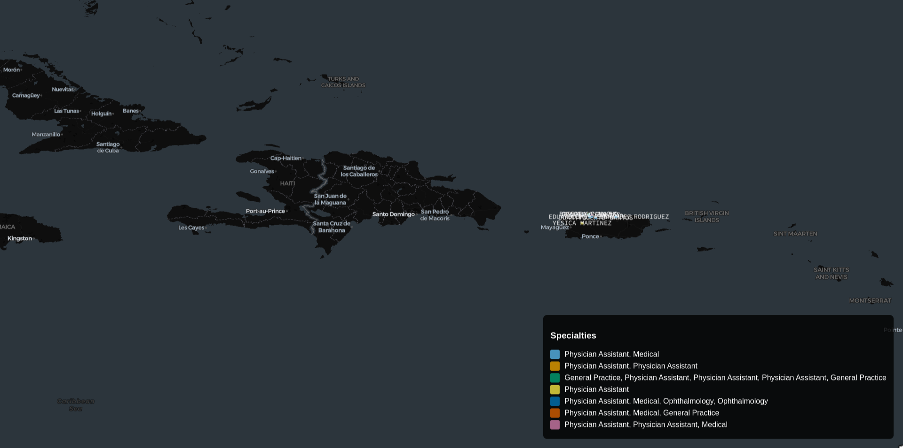
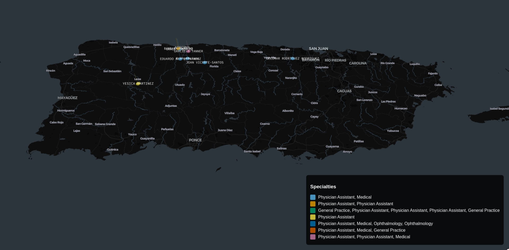
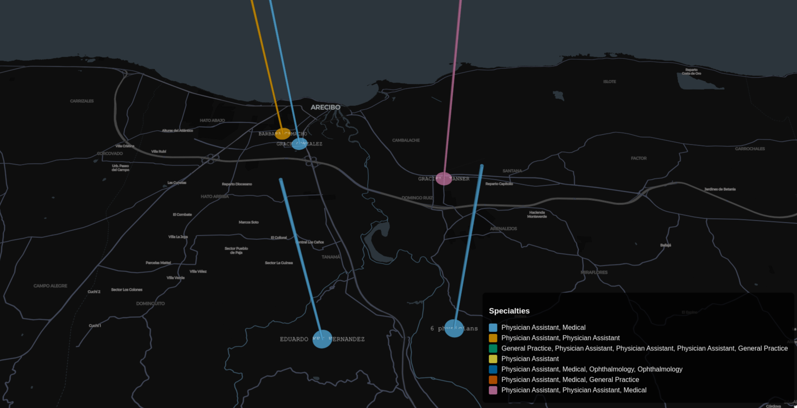
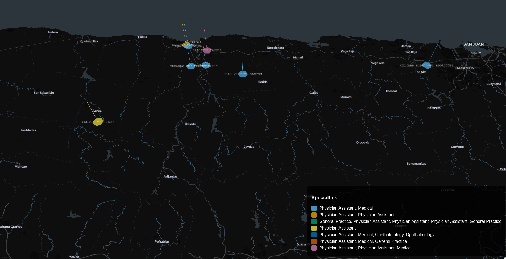

# Mapping Physician Groups in a Metropolitan Statistical Area Using NPI and LLMs

This project aims to develop an AI-driven system that maps physician groups (PGs) within a given Metropolitan Statistical Area (MSA). The system utilizes a dataset linking MSAs to counties and ZIP codes, retrieves physician details from the National Provider Identifier (NPI) registry API, and employs a large language model (LLM) to determine the physician groups they are associated with. The extracted data is then visualized on an interactive map, providing insights into the distribution of healthcare providers across the selected region.

This solution integrates data processing, API interactions, natural language understanding, and geospatial visualization, making it a valuable tool for healthcare analytics, resource allocation, and strategic planning.

### Architecture:


### Output Visualizations:







### Demo Video:

[watch the video](./output_images/demo_video.mp4)

# Steps To Run & Execute The Code:

## 1. Data Cleaning Using `merge.py`

The `merge.py` script is used for data cleaning. It processes the datasets from the following sources:

- [HUD ZIP-County dataset](https://www.huduser.gov/portal/datasets/usps_crosswalk.html)
- [BLS County-MSA-CSA Crosswalk dataset](https://www.bls.gov/cew/classifications/areas/county-msa-csa-crosswalk.html)

Run the script as follows:

```bash
python merge.py
```

## 2. Fetch Physician Data Using `api_test.py`

The `api_test.py` script retrieves physician data from the NPI API. The fetched data is stored as JSON files in the `physician_data` directory, with each file corresponding to a specific MSA.

Run the script using:

```bash
python api_test.py
```

## 3. Process Data Using `llm.py`

The `llm.py` script processes the physician data and performs **physician group analysis** using a **language model (LLM) from Hugging Face**. It takes an input JSON file from the `physician_data` directory and generates `msa_data_with_pg.json`.

Run the script using:

```bash
python llm.py
```

## 4. Visualize Data Using `plot.py`

The `plot.py` script is responsible for **visualizing physician group data** after processing it with `llm.py`. It takes `msa_data_with_pg.json` as input and generates an interactive map.

Run the script using:

```bash
python plot.py --api-key YOUR_API_KEY /home/lone/Projects/Vivnovation/Final_Project/msa_data_with_pg.json
```

Replace `YOUR_API_KEY` with your actual API key.

## Directory Structure:

```bash
├── merge.py   
├── api_test.py              
├── llm.py              
├── plot.py                    
├── physician_data/           
│   └── physicians_Utuado__PR_MicroSA_20250218_034313.json  # Example physician data
├── msa_data_with_pg.json      
└── physician_grouping.log     
```

## Summary of Execution Flow:

1. **Run `merge.py`** to clean and merge datasets.
2. **Run `api_test.py`** to fetch physician data from the NPI API and store it in `physician_data/`.
3. **Run `llm.py`** to analyze physician groups using an LLM and generate `msa_data_with_pg.json`.
4. **Run `plot.py`** to visualize the physician groups on a map.

This structured approach ensures a smooth execution pipeline from data collection to visualization.


