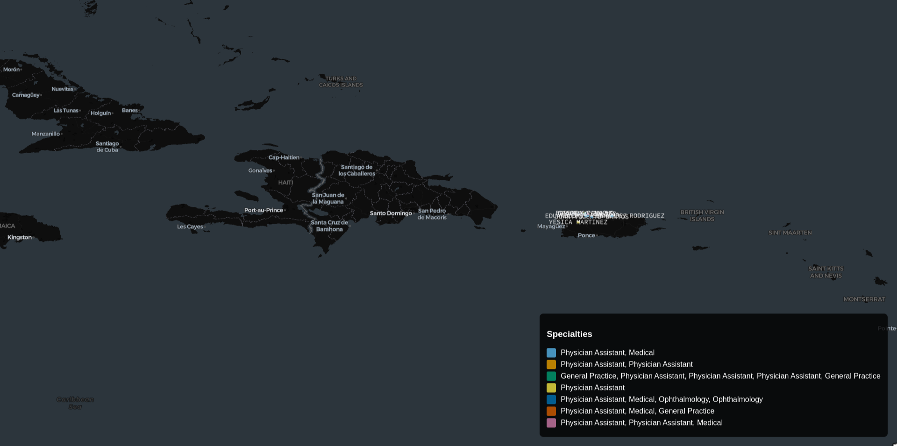
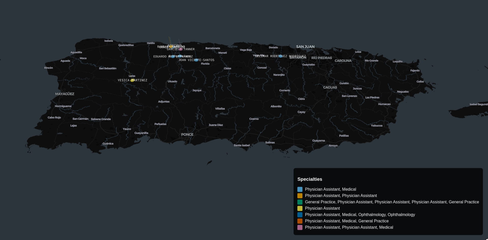
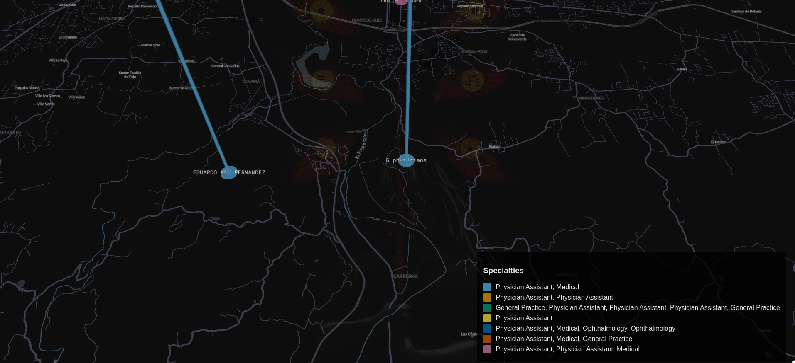
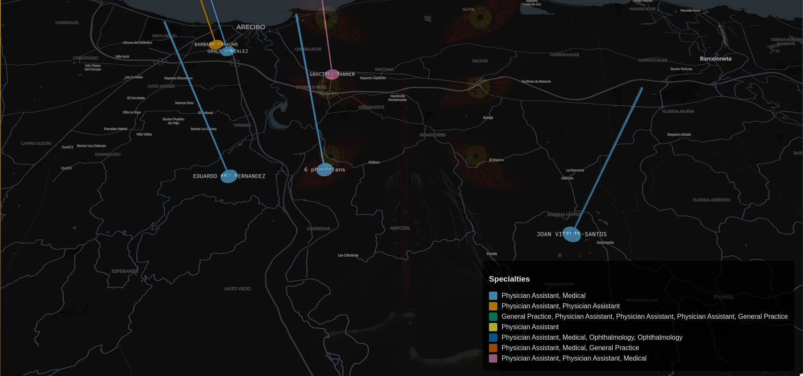

# Mapping Physician Groups in a Metropolitan Statistical Area Using NPI and LLMs

This project aims to develop an AI-driven system that maps physician groups (PGs) within a given Metropolitan Statistical Area (MSA). The system utilizes a dataset linking MSAs to counties and ZIP codes, retrieves physician details from the National Provider Identifier (NPI) registry API, and employs a large language model (LLM) to determine the physician groups they are associated with. The extracted data is then visualized on an interactive map, providing insights into the distribution of healthcare providers across the selected region.

This solution integrates data processing, API interactions, natural language understanding, and geospatial visualization, making it a valuable tool for healthcare analytics, resource allocation, and strategic planning.

### Architecture:
.svg)

### Output Visualizations:





# Progress Breakdown:

### **1. Initial Setup and Planning**

- **Objective Clarification:** Defined the scope of the project and its goal of generating a map with Physician Groups (PGs) within a given MSA.
- **Tools & Libraries Chosen:**
    - **Programming Language:** Python
    - **Libraries:**
        - `pandas` for data manipulation and cleaning
        - `requests` for API interactions
        - `matplotlib` for mapping visualization
        - `geopandas` for spatial data handling
        - LLM API (e.g., OpenAI, Hugging Face) for determining PGs
    - **Datasets Used:**
        - **HUD ZIP-County dataset (Q3 2023):** Cleaned and pre-processed for MSA->Counties->Zipcode relationships.
        - **NPI Registry API:** Used to fetch physician data (including specialties and locations).

### **2. Data Preprocessing**

- **HUD ZIP-County Dataset (Q3 2023):**
    - **Cleaned the data** by addressing missing values, redundant information, and ensuring consistency.
    - **Structured the data** to create mappings between MSA, counties, and zip codes, which will be used later for fetching physician data from the NPI registry.
    - **Key Columns Processed:**
        - `MSA Code`
        - `County Name`
        - `Zipcode`
- **Physician Data Processing:**
    - Extracted relevant fields from the NPI registry API response:
        - Physician name
        - Specialty
        - Location (for filtering by MSA)

### **3. Fetching Physician Data (via NPI Registry API)**

- **API Interaction:**
    - **Used the NPI registry API** to fetch a list of physicians within a given MSA.
    - **Filtered the physicians** based on their location (county/zipcode) to match the MSA input.
    - **Handled API rate limits and pagination** to ensure that all relevant physician data was retrieved.

### **4. Determining Physician Groups (PGs)**

- **LLM API Integration:**
    - Used an LLM API to analyze the retrieved physician data and determine the Physician Groups (PGs) they belong to.
    - **Input to LLM API:** Physician name, specialty, and location.
    - **Output from LLM API:** List of Physician Groups each physician works at.
- **Data Parsing and Integration:**
    - Parsed the LLM API response to identify the PGs for each physician and linked them to the physician’s data.

### **5. Data Mapping and Visualization**

- **Mapping PGs to MSAs:**
    - Used the MSA->County->Zipcode mapping from the HUD dataset to plot the Physician Groups within the given MSA.
- **Visualization:**
    - Created a **geospatial map** showing the location of each Physician Group within the MSA using libraries like `geopandas` and `matplotlib`.
    - **Map Features:**
        - MSA boundaries
        - Counties and zip codes
        - Markers representing PGs

### **6. Final Output**

- The program takes an MSA code as input and produces a map with the Physician Groups located within the specified MSA.
- The map includes markers for each PG, with additional details such as the name and specialty of the physicians working within each group.

### **7. Pending/To-Do:**

- **Testing and Validation:**
    - Testing the system for various MSAs to ensure correctness and consistency.
    - Verifying the accuracy of Physician Group identification by cross-checking with external data sources (if needed).
- **Enhancement:**
    - Consider adding features like filtering PGs by specialty or providing a detailed physician profile popup on the map.

---

### **Challenges Faced:**

- **Data Inconsistencies:** Some missing or incomplete data in the HUD dataset and the NPI registry, requiring additional preprocessing steps.
- **API Rate Limiting:** Managing NPI API limits while retrieving large datasets.
- **LLM API Limitations:** Ensuring that the LLM API correctly identified and classified Physician Groups for diverse specialties.

# Steps To Run & Execute The Code:

```python
├── merge.py   
├── api_test.py              
├── plot.py                    
├── physician_data/           
│   └── physicians_Utuado__PR_MicroSA_20250218_034313.json  # Example physician data
├── msa_data_with_pg.json      
└── physician_grouping.log     
```

## 1. The [merge.py](http://merge.py) is used in order to data cleaning,I have used the below given datasets

```markdown
https://www.huduser.gov/portal/datasets/usps_crosswalk.html
https://www.bls.gov/cew/classifications/areas/county-msa-csa-crosswalk.html
```

```python
import pandas as pd

# Load the ZIP-County dataset (ZIP → County mapping)
zip_county_df = pd.read_csv("zip_county.csv")  # Adjust path to your file

# Check the column names in the ZIP-County dataset
print("ZIP-County Dataset Columns:")
print(zip_county_df.columns)

# Clean up any leading/trailing spaces in column names
zip_county_df.columns = zip_county_df.columns.str.strip()

# Rename 'COUNTY' column to 'County FIPS' if necessary
zip_county_df.rename(columns={"COUNTY": "County FIPS"}, inplace=True)

# Load the MSA-County dataset (County → MSA mapping)
msa_county_df = pd.read_csv("msa_data.csv")  # Adjust path to your file

# Check the column names in the MSA-County dataset
print("\nMSA-County Dataset Columns:")
print(msa_county_df.columns)

# Clean up any leading/trailing spaces in column names
msa_county_df.columns = msa_county_df.columns.str.strip()

# Rename 'County Code' column to 'County FIPS' for consistency (if they represent the same thing)
msa_county_df.rename(columns={"County Code": "County FIPS"}, inplace=True)

# Verify the data types of the key columns
print("\nData Types in ZIP-County Dataset:")
print(zip_county_df.dtypes)

print("\nData Types in MSA-County Dataset:")
print(msa_county_df.dtypes)

# Convert the 'County FIPS' column to string if needed
# Ensure both columns are of the same data type (string)
zip_county_df["County FIPS"] = zip_county_df["County FIPS"].astype(str)
msa_county_df["County FIPS"] = msa_county_df["County FIPS"].astype(str)

# Merge the datasets on 'County FIPS'
merged_df = pd.merge(zip_county_df, msa_county_df, on="County FIPS", how="left")

# Inspect the merged dataset
print("\nMerged Dataset:")
print(merged_df.head())

# Save the merged result to a new CSV
merged_df.to_csv("msa_county_zip_merged.csv", index=False)

```

## 2. API_Test.py

Run the api_test.py in order to fetch all the details from the NPI_API

```python
python api_test.py
```

## 3. llm.py

The `llm.py` script processes physician data and performs **physician group analysis** using a **language model (LLM) from Hugging Face**

```python
python llm.py
```

## 4. plot.py

The `plot.py` script is responsible for **visualizing physician group data** after processing it with `llm.py`.

```python
python plot.py --api-key 0d1531520cc24f22b7e2377917456c1a /home/lone/Projects/Vivnovation/Final_Project/msa_data_with_pg.json
```
